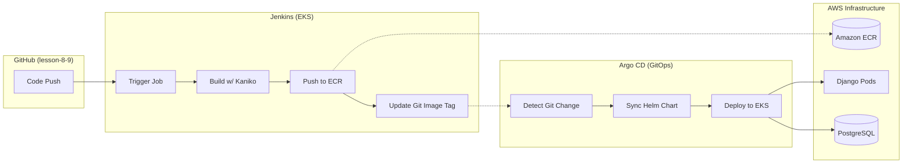

# Django App CI/CD: Terraform, Jenkins & Argo CD

This project demonstrates a fully automated **GitOps** lifecycle for a Django application.
It leverages **Infrastructure as Code (Terraform)**, **Continuous Integration (Jenkins + Kaniko)**, and **Continuous Deployment (Argo CD)** on a managed **AWS EKS** cluster.

## Architecture & CI/CD Flow

## Key Features & Security

ECR Security: Repository policy is restricted to the specific AWS Account ID via IAM Principal (no public access).

Secret Management: Sensitive data (SECRET_KEY, DATABASE_URL) is managed via environment injection and excluded from Git via .gitignore.

Multi-Stage Dockerfile: Optimized Django image running as a non-root user for enhanced security.

Database Persistence: Integrated PostgreSQL as a Helm dependency with Persistent Volume storage.

Jenkins Stability: PersistentVolume (PV) enabled to ensure job configurations survive restarts.

## 1. Infrastructure Deployment (Terraform)

The infrastructure is deployed in the eu-west-1 region.

Initialize & Apply:

>> terraform init
>> terraform apply --auto-approve
Result: Creates a VPC, EKS Cluster, and a private ECR registry at 829703038395.dkr.ecr.eu-west-1.amazonaws.com/lesson-8-9-ecr.

## 2. Continuous Integration (Jenkins)

Jenkins handles the build process inside the cluster.

Build & Push: Uses a Kaniko agent (rootless) to build the Docker image and push it to AWS ECR. Authentication is handled via a Kubernetes Secret regcred.

Git Update: Upon a successful push, Jenkins commits a change to lesson-8-9/charts/django-app/values.yaml updating the tag to match the build number (tag: '45').

Verification: Check the Jenkins UI for a "Success" status and verify the automated commit in GitHub.

## 3. Continuous Deployment (Argo CD)

Argo CD implements GitOps by synchronizing the cluster state with the Git configuration.

Access the Dashboard:

>> kubectl get svc -n argocd argo-cd-argocd-server
URL: https://a04ef8ea87ecf4604a31e5fc90291149-530623759.eu-west-1.elb.amazonaws.com

Sync Check: Ensure the django-app shows a Synced status. Clicking the application card will display the resource tree (Deployment, Service, Pods).

Verify Pods:

>> kubectl describe pod | grep Image:
Result: Image should match the latest Jenkins build (e.g., :45).

## 4. Resource Cleanup
To avoid unnecessary AWS costs, destroy the infrastructure when finished:

>> terraform destroy --auto-approve