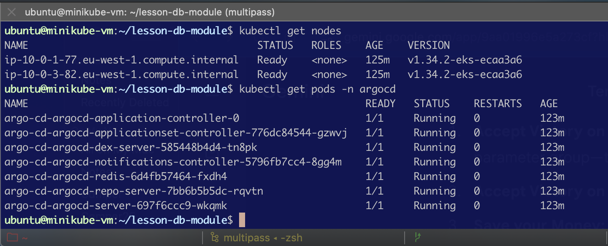

# Django App CI/CD: Multi-Engine Database Module
This branch (lesson-db-module) implements a production-grade Terraform orchestration to deploy a containerized Django application with a flexible AWS database backend.

## Project Architecture
The project is structured into independent, reusable modules. The root **main.tf** orchestrates the flow of data between networking, compute, and storage layers.

## Key Components
- VPC Module: Creates a secure network across 3 AZs.
- EKS Module: Provisions the Kubernetes cluster for our application.
- RDS Module (Refactored): A unified module that switches between Aurora Cluster and Standard RDS based on the use_aurora variable.

- GitOps (Argo CD): Uses the App-of-Apps pattern to bootstrap the Django application and its PostgreSQL dependencies.

## Module Logic:
The RDS/Aurora Toggle
The RDS module is designed for "Environment Portability."

Terraform# Standard RDS (Development)
use_aurora     = false
instance_class = "db.t3.micro"

## Aurora Cluster (Production)
        use_aurora            = true
        instance_class        = "db.t3.medium"
        aurora_instance_count = 2

## Configuration & Deployment
1. Variables (**terraform.tfvars**)
Create this file locally (ignored by Git) to store environment specifics:
VariableDescriptionExamplenameBase name for resourcesgoit-devops-hw03use_auroraEnable Aurora ClustertrueusernameMaster DB userpostgrespasswordMaster DB pass***********

2. Deployment Sequence
Inside multipass shell **minikube-vm**, run:
    # Initialize S3 backend and providers
        terraform init

    # Validate configuration syntax
        terraform validate

    # Review the execution plan
        terraform plan -out=db.plan

    # Deploy to AWS
        terraform apply "db.plan"

## Security and PersistenceState Management:
Configured in **backend.tf** using S3 for storage and DynamoDB for state locking.

### Security Group "Handshake" Logic
The project implements a Least Privilege networking model. Instead of opening the database to the entire VPC, we use a dynamic security group reference:

The Source: The EKS module exports the node_security_group_id.

The Sink: The RDS module's Security Group accepts ingress only on port 5432 from that specific ID.

    # modules/rds/main.tf
    ingress {
    from_port       = 5432
    to_port         = 5432
    protocol        = "tcp"
    security_groups = [var.eks_node_sg_id] # Direct reference to EKS nodes
    }

## Credential Masking:
All database credentials in **outputs.tf** are marked as sensitive = true to prevent accidental exposure in logs.
 
## Network Isolation:
The database is strictly located in private_subnets, accessible only by the EKS Worker Node Security Group.
 
## Verification
 After a successful apply, retrieve Django connection string directly from the Terraform outputs:
 
 Get the raw connection string for .env file
        terraform output -raw django_database_url

## Project Outcome Summary

Infrastructure: Successfully provisioned a VPC (3 AZs), EKS Cluster (v1.34), and RDS Instance via Terraform.

    module.rds.aws_db_instance.this[0]: Creating...
    module.rds.aws_db_instance.this[0]: Still creating... [10s elapsed]
    ...
    module.rds.aws_db_instance.this[0]: Creation complete after 6m8s [id=db-IWPN7ERBT3AJ2PVW2LGNDBFJVQ]

Database Layer: Deployed PostgreSQL 17.2 on RDS db.t3.micro using a custom Parameter Group. Verified successful creation in 6m 8s.

CI/CD Layer: Successfully bootstrapped Argo CD via Helm.

Storage Resolution: Identified a pending state in the Jenkins StatefulSet caused by missing EBS driver configurations. Successfully implemented a manual gp3 StorageClass and resolved driver conflicts via the AWS CLI.

Cost Management: Terminated all resources immediately following verification to ensure budget compliance.

### Kubernetes Cluster Readiness
Worker nodes and Argo CD pods in a healthy state.
