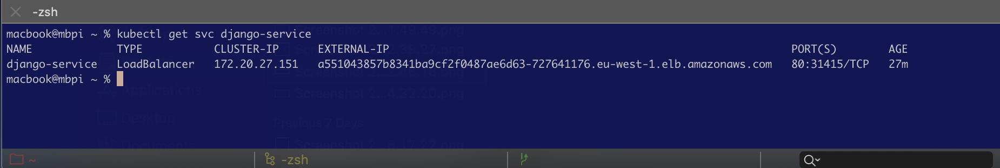
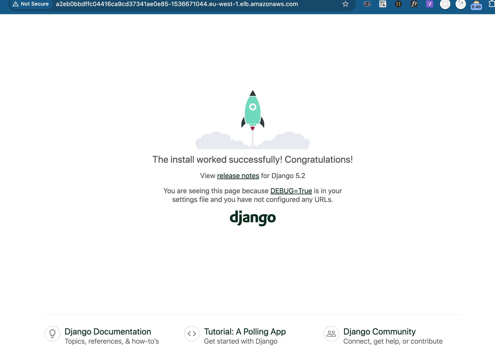
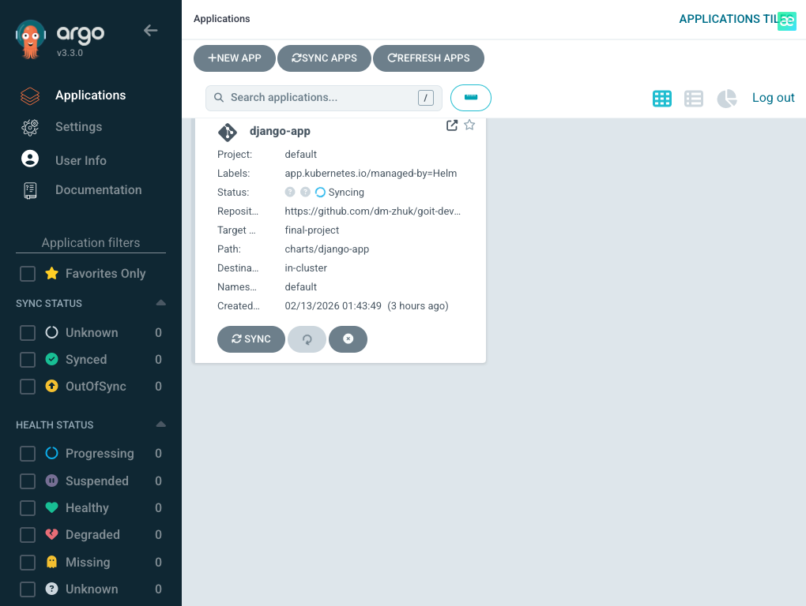
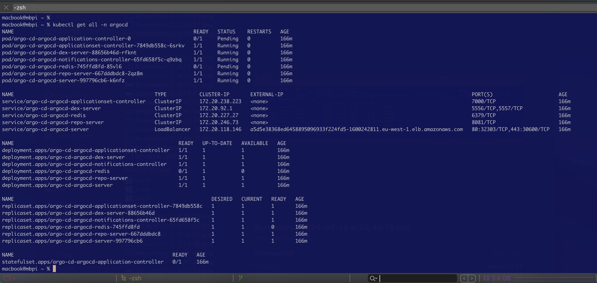

# Final Project: Production-Ready Infrastructure on AWS EKS

Цей проект демонструє розгортання масштабованої та відмовостійкої інфраструктури для Django-додатка в хмарі AWS. Основним викликом була реалізація складного стеку DevSecOps в умовах жорстких лімітів **AWS Free Tier**.

## Архітектура рішення
Проект побудований на базі мікросервісної архітектури з використанням наступних технологій:
* **Infrastructure as Code (IaC):** Terraform для управління VPC, EKS, RDS та ECR.
* **Оркестрація:** Amazon EKS (Kubernetes) версії 1.31.
* **База даних:** Managed Amazon RDS PostgreSQL.
* **CI/CD:** Jenkins (Build) та Argo CD (GitOps Deployment).
* **Sidecar Pattern:** Використання Nginx як реверс-проксі для Django в одному Поді.

---

## Реалізація інфраструктури (Terraform)

### 1. Масштабування для обходу лімітів VPC CNI
Через ліміт IP-адрес на інстансах типу `t3.micro` (макс. 11 подів на вузол), кластер було горизонтально масштабовано до **8 робочих вузлів**. Це дозволило успішно розмістити системні сервіси (Argo CD, Monitoring) разом із додатком.

### 2. Управління станом (State Management)
Для забезпечення безпеки та спільної роботи налаштовано **Remote State Backend**:
* **S3 Bucket:** Зберігання файлу `terraform.tfstate`.
* **DynamoDB Locking:** Запобігання конфліктам при паралельному запуску команд.
* **Примітка:** Файл `backend.tf.bak` збережено як резервну копію для можливості локального відновлення після очищення ресурсів.

---

## Розгортання додатка та GitOps

### 1. Helm & Sidecar Pattern
Додаток розгорнуто за допомогою Helm-чарту. Реалізовано Sidecar-патерн:
* **Container 1 (Django):** Слухає порт 8000, обробляє логіку.
* **Container 2 (Nginx):** Слухає порт 80, роздає статичні файли та проксіює запити до Django.
* **Shared Volume:** Спільний `emptyDir` для передачі статичних файлів між контейнерами.

### 2. Автоматизація міграцій (Database Migrations)
Для забезпечення цілісності БД реалізовано **Kubernetes Job** з використанням **Helm Hooks**. Це дозволяє автоматично запускати міграції (`python manage.py migrate`) перед оновленням основних подів додатка.

```yaml
# migration-job.yaml
annotations:
  "helm.sh/hook": post-install,post-upgrade
  ```

## Моніторинг та CI/CD

### Поточний статус сервісів:
- **Jenkins**: Налаштовано пайплайн для збірки Docker-образів та їх Push до ECR.

- **Argo CD**: Використовується для автоматичної синхронізації змін із GitHub репозиторію.

- **Grafana/Prometheus**: Стек розгорнуто у просторі імен **monitoring**.

##  Troubleshooting

| **Проблема**               | **Причина**                             | **Вирішення**                                                                |
| :---                       | :---                                    | :---                                                                         |
| **Pending Pods**           | Вичерпання IP-адрес на вузлах (VPC CNI) | Збільшення кількості нод до 8 та оптимізація Resource Requests.              |
| **Static Files Not Found** | Відсутність спільного тому (shared volume) | Реалізовано `emptyDir` та автоматичний `collectstatic` в `entrypoint.sh`. |
| **Helm/Argo Conflict**     | Конфлікт метаданих власності ресурсів | Використано `helm upgrade --install` з очищенням старих анотацій.              |
| **Empty Database**         | Пропущені міграції при першому запуску | Додано `python manage.py migrate` у `entrypoint.sh` та Helm Migration Job.    |
| **S3 Backend Error**       | Спроба ініціалізації без існуючого бакета | Тимчасовий лок. стейт для створення S3 бакета через модуль `s3_backend`.   |

## Як відтворити проект

1. IaC:

```bash
cd terraform/
terraform init && validate
terraform apply
```

2. K8s Configuration:
   Налаштуйте доступ до кластера через aws eks update-kubeconfig.

3. Application:

```bash
cd charts/django-app/
helm upgrade --install django-app . -f values.yaml
```

## Як відтворити проект
IaC:

```bash
cd terraform/
terraform init
terraform apply
```

2. K8s Configuration:
Налаштуйте доступ до кластера через aws eks update-kubeconfig.

3. Application:

```bash
cd charts/django-app/
helm upgrade --install django-app . -f values.yaml
```

## Скріншоти

- Nodes Status:


- Pods Status:


- Service Availability (LB IP):




- Argo CD Panel:


